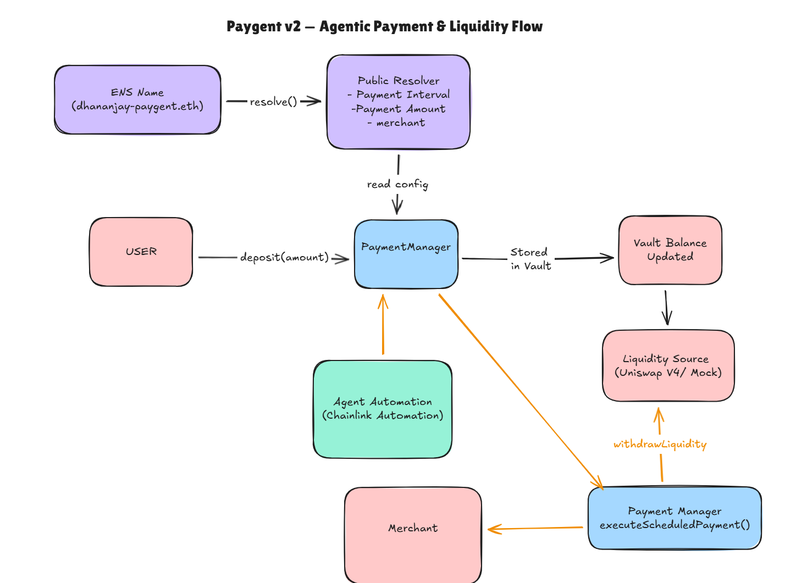

# Paygent v2

> Paygent v2 uses ENS as a live, on-chain configuration layer that controls how subscription payments execute.

Paygent v2 is an on-chain subscription payment protocol that turns **idle subscription funds into executable, automated payments** using ENS-based configuration and Chainlink Automation.

In other words, **Paygent v2 makes idle subscription funds alive** — funds are not just locked, they are actively scheduled, verified, and executed on-chain under strict protocol rules.

---

## Contents

- [Problem](#problem)
- [Solution](#solution)
- [Architecture Overview](#architecture-overview)
- [ENS Integration](#ens-integration-prize-eligibility)
- [Automation](#automation)
- [Deployed Contracts (Sepolia)](#deployed-contracts-sepolia)
- [Uniswap v4 Integration](#uniswap-v4-integration)
- [Demo Walkthrough](#demo-walkthrough)
- [Summary](#summary)

## Problem

Traditional subscription systems lock capital until payment time.

- Funds sit idle and opaque
- Execution relies on trusted off-chain schedulers
- Payment logic is hardcoded and inflexible

Capital is locked, but not alive.

---

## Solution

Paygent v2 separates **custody**, **configuration**, and **execution**:

- Funds are held safely in user vaults
- Payment logic is defined externally via ENS
- Execution is triggered autonomously via on-chain automation

Funds only become executable when explicit protocol conditions are met.  
Automation cannot bypass safety checks.

---

## Architecture Overview

- **User Vault**  
  Holds deposited funds and enforces accounting rules.

- **ENS Strategy (Configuration Layer)**  
  Stores payment parameters such as merchant, amount, and interval via a Public Resolver.

- **Executor (Liquidity Layer)**  
  Holds explicitly deployed liquidity for execution.

- **Automation (Execution Trigger)**  
  Calls into the protocol only when conditions are satisfied.

This separation ensures flexibility without sacrificing safety.

### System Flow

---

## ENS Integration (Prize Eligibility)

Paygent v2 uses Ethereum Name Service (ENS) as a **core protocol dependency**, not a naming convenience.

Payment strategies are stored as ENS text records and resolved on-chain at execution time:

- `merchant` — recipient address  
- `paymentAmount` — amount per interval  
- `paymentInterval` — execution frequency  

### ENS Strategy Reference

The subscription strategy for this demo is anchored to the following ENS name:

- **ENS Name:** `dhananjay-paygent.eth`
- **ENS Node (namehash):** `0x0c3fd11975849d570fb3bf2b8bfcaacf832bd0b827c4fc54f88a1905ff95b1f9`

This node is resolved on-chain via the ENS Registry and its associated **Public Resolver**.
All payment parameters are read from resolver text records at execution time.

The protocol does not rely on off-chain metadata or hardcoded values —  
**the ENS node itself is the source of truth.**

### Why ENS Matters

ENS acts as **protocol state**:

- Payment logic lives in ENS, not immutable bytecode
- Strategies can be updated without redeploying contracts
- Automation always executes against the latest ENS configuration
- All changes are transparent and on-chain

### Eligibility Statement

Paygent v2 is eligible for the ENS track because **the protocol cannot function without ENS**.

Without ENS:
- payment strategies cannot be defined
- execution parameters cannot be updated
- automation has no source of truth

ENS directly controls how and when funds become executable.

---

## Automation

Paygent v2 integrates with **Chainlink Automation** for autonomous execution.

- `checkUpkeep()` verifies payment conditions on-chain
- `performUpkeep()` executes payments through the manager
- Execution is permissionless and fully verifiable

Automation has been **successfully verified live on Sepolia**, with Chainlink nodes executing payments and spending LINK for gas.

---

## Deployed Contracts (Sepolia)

The protocol has been deployed and verified on **Sepolia testnet**.

| Contract | Address | Etherscan |
|--------|--------|----------|
| PaymentManager | `0x83a906afdd0e7010e73d7b5a262527d79929d3b2` | https://sepolia.etherscan.io/address/0x83a906afdd0e7010e73d7b5a262527d79929d3b2 |
| PaymentAutomation | `0x6343580abe333849875842Aa503e7e88F9B4e71F` | https://sepolia.etherscan.io/address/0x6343580abe333849875842Aa503e7e88F9B4e71F |
| Mock USDC | `0xcB56e0979ad52Bb3EE2ebA6c82b0EEc40b540265` | https://sepolia.etherscan.io/address/0xcB56e0979ad52Bb3EE2ebA6c82b0EEc40b540265 |
| Executor | `0xc3B06e658ea393fb74DcF1f2009480A5a64a69BF` | https://sepolia.etherscan.io/address/0xc3B06e658ea393fb74DcF1f2009480A5a64a69BF |
| Merchant Account | `0xC5B427983CA9b03F79b357C3AAd243cFaE2Fbf00` | https://sepolia.etherscan.io/address/0xC5B427983CA9b03F79b357C3AAd243cFaE2Fbf00 |
| User Account | `0x80BF81E71EdDd94d852478a9ab078F63959097D5` | https://sepolia.etherscan.io/address/0x80BF81E71EdDd94d852478a9ab078F63959097D5 |
📄 Full address list: `docs/sepolia-addresses.txt`

---

## On-chain Verification (Sepolia)

The end-to-end flow can be verified via:

- Chainlink Automation history (`Perform Upkeep`)
- `PaymentExecuted` events emitted by the protocol
- ERC20 `Transfer` events to the merchant address

All executions were observed live on Sepolia.

---

## Uniswap v4 Integration

Paygent v2 includes a **pluggable Uniswap v4 LiquidityExecutor** that integrates directly with the canonical `PoolManager` using `modifyLiquidity`.

On Sepolia, Uniswap v4 pools are not pre-initialized. As a result:
- direct liquidity deployment reverts
- pool initialization is required before LP actions

We implemented and attempted explicit pool initialization using `PoolManager.initialize`, with correct token ordering and a valid initial price.

🔬 This experimental logic is available on a separate branch: `uniswap-v4-pool-init-attempt` .
See commit: <4b7614dc434f79c047803026928b3384f3aa4d54>

## Demo Walkthrough

1. A user deposits funds into the PaymentManager vault.
2. The payment strategy is resolved on-chain from ENS
   (`dhananjay-paygent.eth` via the Public Resolver).
3. The strategy is activated, making the vault eligible for execution.
4. Funds are explicitly deployed from the vault into the executor
   using `deployLiquidityFromVault`, marking them as executable.
   Automation cannot make funds executable — only this explicit
   protocol state transition can.
5. Chainlink Automation continuously monitors execution conditions.
6. When conditions are met, liquidity is withdrawn from the executor.
7. The scheduled payment is executed on-chain to the merchant address.

## Summary

Paygent v2 demonstrates how ENS and on-chain automation can be combined to create
**safe, flexible, and autonomous subscription payments**.

Instead of locking capital until execution, Paygent treats funds as
*conditionally executable*: governed by ENS-configured strategies and enforced
entirely on-chain.

The protocol cleanly separates custody, configuration, and execution, while
supporting advanced liquidity strategies such as Uniswap v4 through pluggable
executors.
